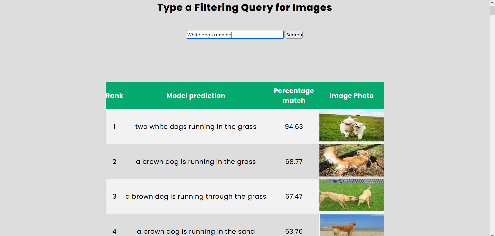

# ImageSearchEngine-using-ImageCaptioning

A search engine created to rank images using the query of user and the text generated using Image Captioning from our attention model .



# Usage

### 1. Clone the repositories

```
git clone <https://github.com/lollinng/ImageSearchEngine-using-ImageCaptioning.git>
cd ImageSearchEngine-using-ImageCaptioning


```

### 2. Add pretraind model trained by us

```
# Create a 'Utils' folder inside application and save this two files inside it
https://drive.google.com/drive/folders/166t7yl4Lj7pmlsaKOeWAqqWboNv0XJm3
```

### 3. Run the flask application

```
python run.py

```
